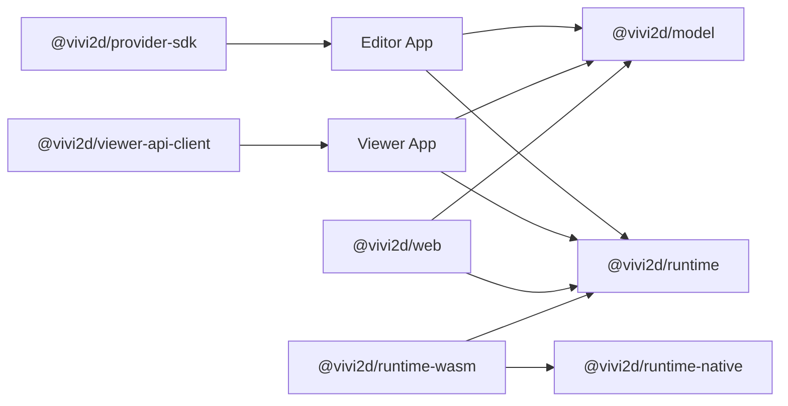
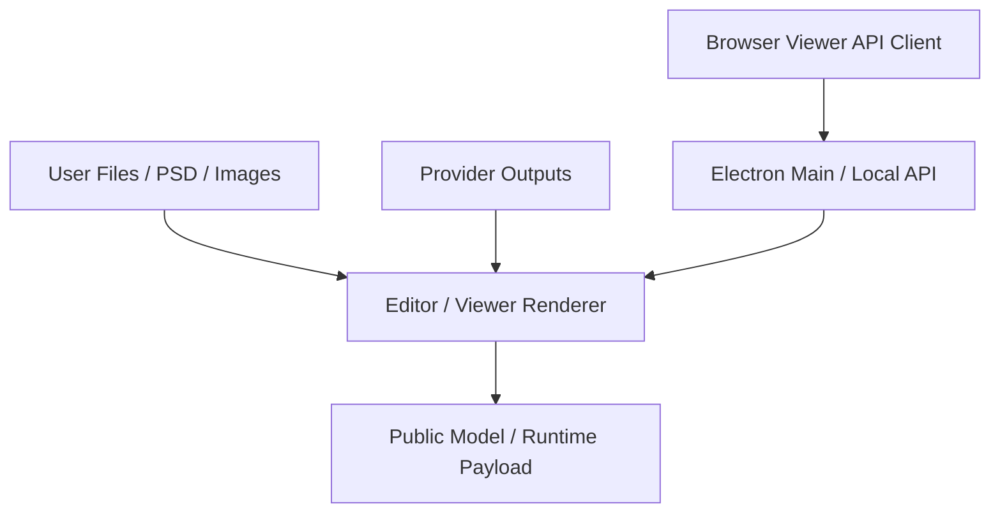
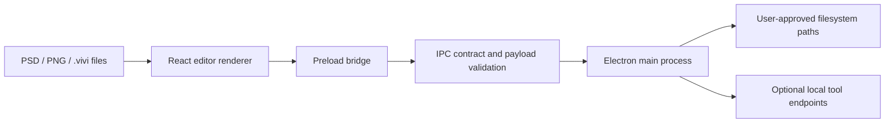
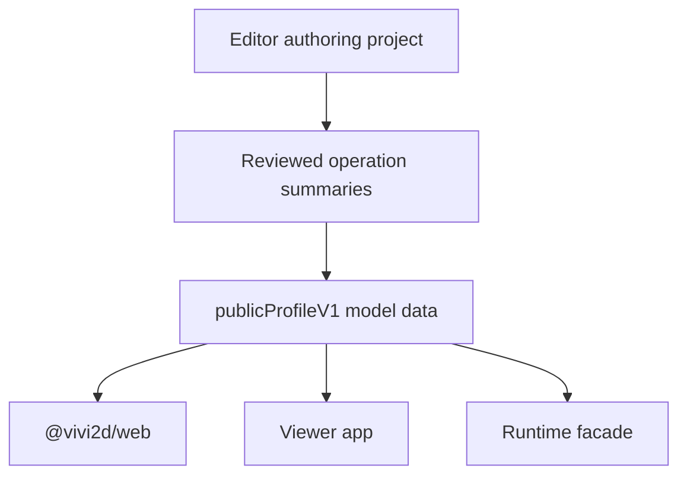
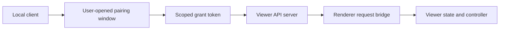
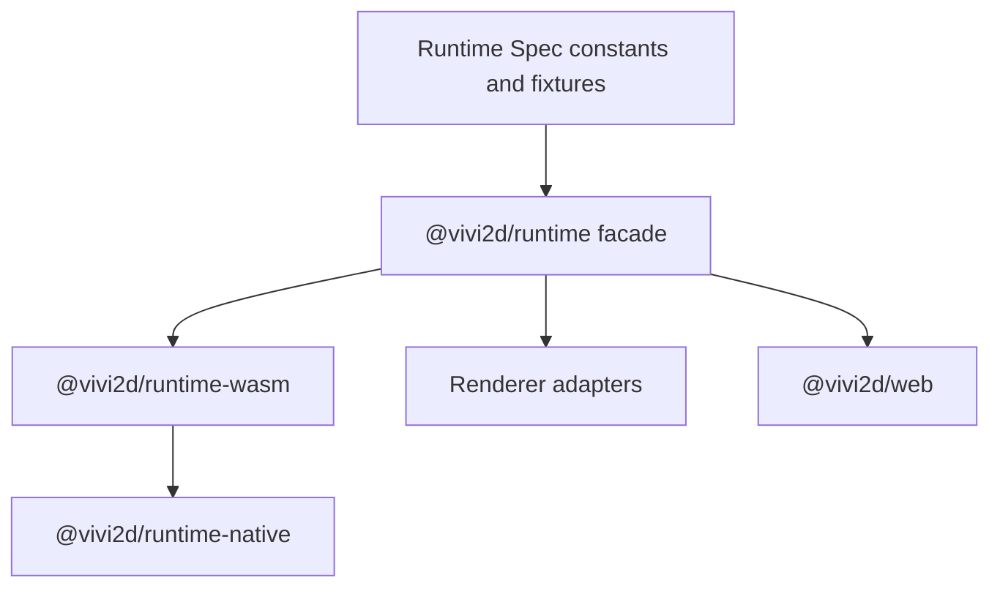

# System Map

This page gives a high-level map of the main Vivi2D systems. It is intentionally
not an API reference. Follow the linked docs for ownership and release status.

## Package And App Overview

## Trust Boundary Overview

## Editor Desktop Boundary

Renderer code must treat IPC as a privilege boundary, not a convenience API.
New channels need a contract entry, unknown fields must fail closed, and file
paths must come from user-mediated dialogs or explicit session allowlists.
Production renderers do not get broad localhost network access; local tool
traffic is mediated by main-process handlers and endpoint policy.

## Model And Public Profile Flow

The public profile contains model, layer, bone, parameter, skin, IK, physics,
and controller data needed for playback. It must not contain editor-only
preview payloads, provider raw responses, private diagnostics, stored local
tool artifacts, or authoring-only temporary data. `packages/model` owns the
public-profile parser and fail-closed guards.

## Provider And Local Tool Flow

```mermaid
flowchart LR
  LocalTool["Optional local tool"]
  ProviderAdapter["Provider adapter"]
  ProviderSdk["Provider SDK boundary"]
  ReviewSurface["Editor review surface"]
  UserAcceptance["User acceptance"]
  SafePlan["Safe editor plan"]
  Project["Project state"]

  LocalTool --> ProviderAdapter
  ProviderAdapter --> ProviderSdk
  ProviderSdk --> ReviewSurface
  ReviewSurface --> UserAcceptance
  UserAcceptance --> SafePlan
  SafePlan --> Project
```

Provider output is untrusted until it crosses editor-owned validation and user
review. Adapters should return bounded proposals and sanitized summaries, not
mutate the project directly. The ComfyUI path follows the same rule: custom
nodes run as local user code, generated results are reviewed in Vivi2D, and raw
paths, prompts, tool logs, and provider response bodies must not become saved
project data or public docs.

## Viewer API Flow

The Viewer API is preview-only and disabled by default. It is loopback-first,
scope-bound, rate-limited, and user-mediated through pairing. New protocol
actions must update the API docs, schema fixtures, client package, renderer
bridge validation, and the Viewer API task guide in the same change.

## Runtime Implementation Flow

Runtime packages are implementation targets for playback behavior and
conformance. They must not import editor UI, Electron main-process code,
provider adapters, or authoring-only mutation commands. Native/WASM artifacts
need separate checksum, provenance, and release-surface review before public
binary distribution.

## Reading The Map

- Editor-only authoring data must be projected before it becomes runtime,
  provider, SDK, or public package data.
- Viewer API clients cross a local API boundary and must stay scoped,
  user-mediated, and loopback-first.
- Provider outputs are untrusted input until editor-owned validation accepts a
  bounded result.
- Runtime packages consume public-profile data and must not import editor UI or
  provider internals.
- Native and WASM packages are implementation targets for runtime behavior, not
  a shortcut around runtime conformance.

## Related Docs

- [`overview.md`](overview.md)
- [`package-graph.md`](package-graph.md)
- [`editor-runtime-boundary.md`](editor-runtime-boundary.md)
- [`../security/threat-model.md`](../security/threat-model.md)
- [`../quality/public-api-status.md`](../quality/public-api-status.md)
